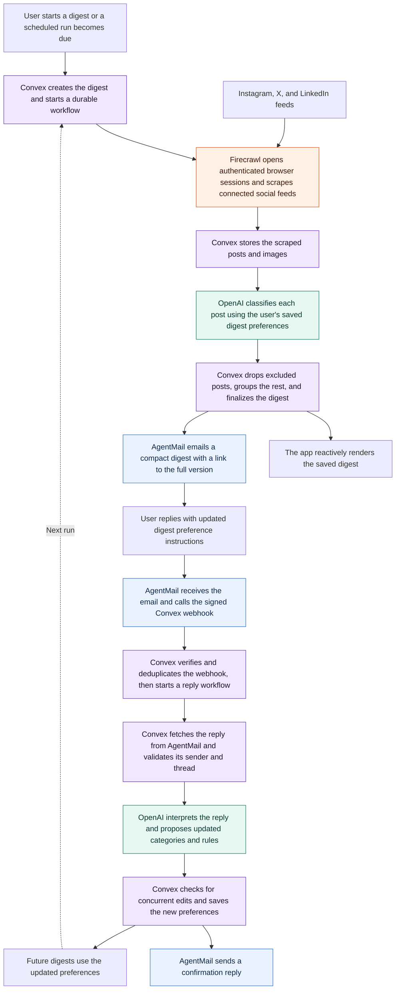

# Digest

Social media is riddled with ads and algorithms created specifically to suck us in and take up our time. But leaving social media entirely is hard, especially because many of us rely on it for information and staying connected with friends and family.

That's where Digest comes in. Digest cuts out all of the bloat and distills your feeds into a daily newsletter, containing only what you really want to see.

### [Try it out here!](https://focused-wolf-619.convex.site/)

> **Please note:** Because of lower rate limits on the free Firecrawl plan, some of the features can time out if multiple people are using the site or things are moving too quickly. Sorry in advance!

---

*Made for the Convex All Gas Hackathon*

---

## How it works

